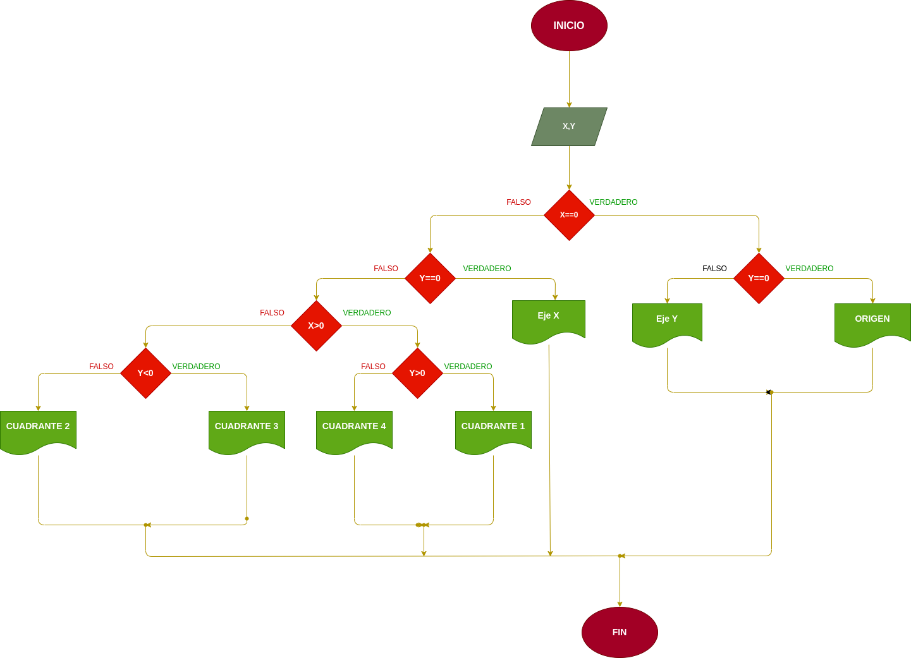

# EJERCICIO NO.1

## Programa que lea las coordenadas cartesianas (x, y) de un punto en el plano y calcule el cuadrante al cual pertenece el punto.

# ANALISIS

Variables de entrada (input)

X,Y:coordenadas del punto
Variables de salida

Eje X
Eje Y
Origen
Cuadrante 1
Cuadrante 2
Cuadrante 3
Cuadrante 4

Nos indicara el punto exacto en el plano cartesiano

# DISEÑO

