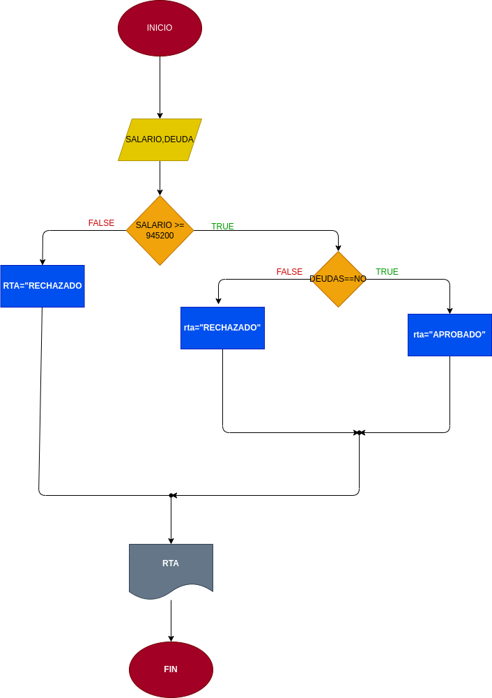

# Ejercicio No.2

## Programa para saber si le aceptan un prestamo en el banco segun su (sueldo y sus deudas)

# ANALISIS

Variables de entrada (input)

sueldo_emp=salario del empleado
deudas=indica si el empleado tiene deudas o no

# PROCCESSING

RTA=variable de texto
APROBADO= salario del empleado >= 945200 Y deudas no
RECHAZADO= salario del empleado <945200 

# DISEÑO

