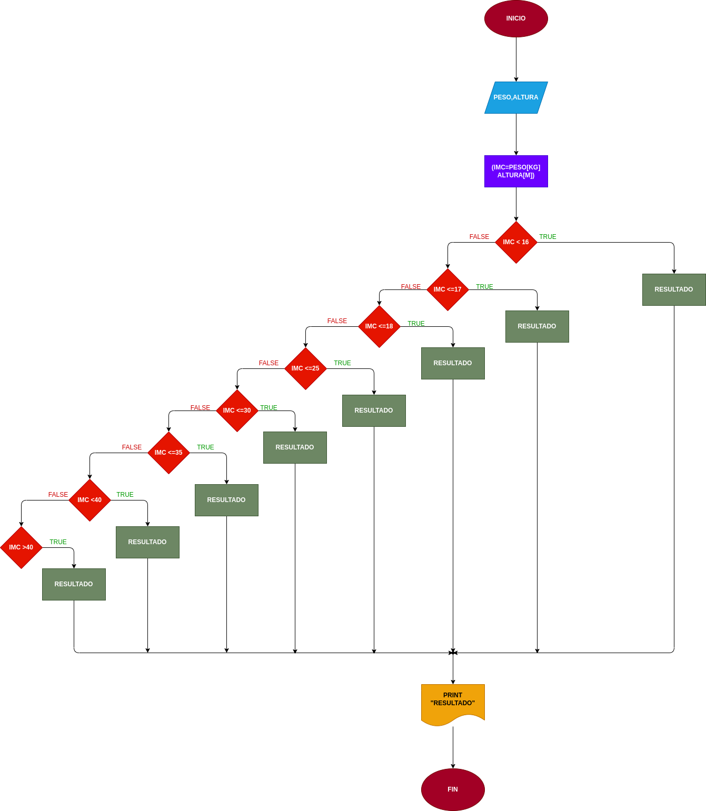

# EJERCICIO No.4
# Masa Corporal
## Programa para saber su masa corporal es de acuerdo a su peso y altura

# Analisis
# input
--Variables de entrada

PESO = su peso ingresado ALTURA = su altura ingresada

# processing

RESULTADOS = son los resultados de su indice de peso

# output

IMC Y RESULTADOS = sultan si indice de peso y el resultado de estos

# DISEÑO

# Construccion