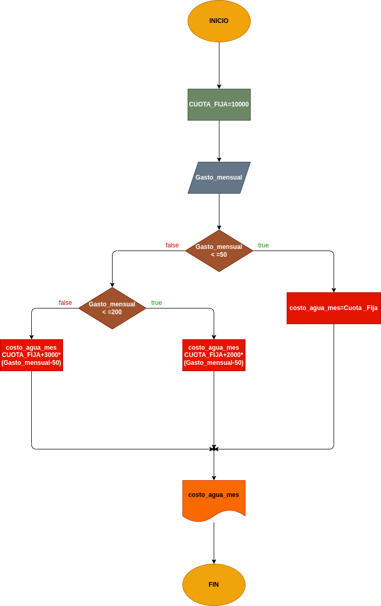

# Precio a pagar por gasto de agua
## Programa para saber el precio adecuado a pagar

# ANALISIS
Variables de entrada (input)

Gasto_mensual

variables de proceso (processing)

Gasto_agua <=50 el costo es la cuota fija

Gasto_agua <=200 el costo de agua es la cuota_fija+2000*Gasto_mensual-50

Gasto_agua >200 el costo de agua es la cuota_fija+3000*Gasto_mensual-50

Variables de salida (output)

Costo agua mes: Es el monto requerido por la empresa a pagar

# DISEÑO

